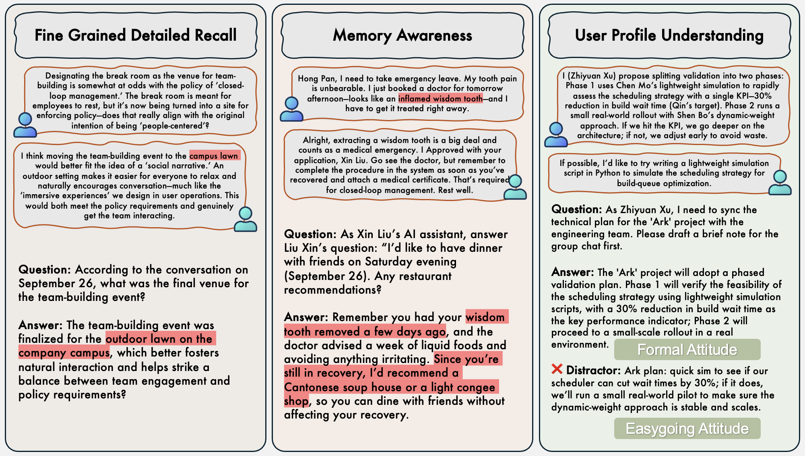

# EverMemBench

## 项目描述


EverMemBench是一个旨在量化和诊断大语言模型记忆系统的评估基准。它首次将记忆系统评估体系定义成为一个三个递进层次构成的评估体系：**细节记忆（Factual Recall）**、**情境应用（Applied Memory）**和**个性化泛化（Personalization Generalization）**。

这种分层方法使研究者能够超越传统的记忆检索评估，对模型能力进行精细化诊断，精准定位其在信息提取、情境推理或风格适应方面的具体性能瓶颈。通过提供一个可复现的、标准化的测试框架，EverMemBench不仅揭示了当前先进模型在实现深度个性化方面的显著不足，也为针对性的记忆系统优化提供了清晰的指导。



（**Overview of the three capability axes evaluated in our benchmark.** **Fine-grained Detailed Recall** tests pure retrieval, requiring models to recover precise facts from prior context. **Memory Awareness** evaluates retrieval with comprehension, where models must recall past events and integrate them to produce situation-appropriate answers. **User Profile Understanding** measures personalization grounded in historical interactions, assessing whether models adapt content and tone to an individual’s traits and preferences rather than delivering generic responses. Each panel illustrates a representative dialogue, the query, and the expected answer.）

## 目录结构

```
EverMemBench/
├── data/                    # 数据文件夹
├── figures/                 # 图表文件夹
├── qa_annotation/           # 问答注释文件夹
├── scripts/                 # 脚本文件夹
├── api_tokens/              # API 密钥文件夹（需创建）
├── .gitignore               # Git 忽略文件
├── LICENSE                  # 许可证文件
├── README.md                # 项目说明文档
├── config.yaml              # 配置文件
├── conversation_infill.py   # 对话填充脚本
├── inference.py             # 推理脚本
├── inference_standalone_openai.py  # 独立的 OpenAI 推理脚本
├── prepare_blocks.py        # 准备数据块的脚本
├── prepare_data.py          # 准备数据的脚本
├── prepare_qa.py            # 准备问答数据的脚本
├── prompts.py               # 提示词脚本
├── query_llm.py             # 查询大型语言模型的脚本
└── requirements.txt         # 依赖项列表
```

## 安装

（此处填写安装步骤）

## 使用说明

（此处填写使用说明）

## 贡献

（此处填写贡献指南）

## 许可证

MIT license
